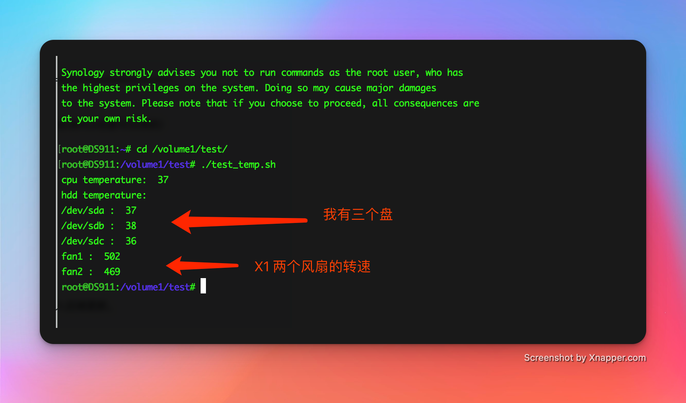

## 联想个人云X1 刷群晖 深度优化状态灯与风扇控制

#### 安装
    1. 先ssh登陆，切换到root账户。运行 sudo -i 

    2. 把全部文件copy到任意目录，运行 ./install.sh

    3. 群晖里需要把网络设置成bond模式。独立网卡模式检测不了网络状态。
 
 
 

 ### 内部逻辑修改
    # ==============================================================================
    # by mu3517
    # 
    # 本脚本修改及程序移植于 X1 系统。 仅供学习参考。（由于没有其他机型硬件，应该X1s也是可以用的）
    #
    # 状态灯部分：
    # 1. 取消了硬盘错误状态监测， 盘位更新各种监测。
    # 2. 只检测盘位是否正常加载。 后续慢慢更新！
    # 3. 网络部分完全正常，正常白灯拔掉网线蓝灯闪烁。只是反应没那么即时。
    #
    # 风扇部分：
    # 1. 完整移植了 X1 内部控制算法，但是与群晖的界面控制还是不兼容。
    # 2. 具体温度控制可以参考
    #
    # 电源部分：
    # 暂时只是copy了 power-ctl 通过脚本可以使长按电源3s关机生效。 这里没加入后续更新。
    #
    # 喇叭提示部分：
    # 由于群晖需要编译驱动暂时没研究搭建编译（有点懒，主要是群晖系统太麻烦了各种缺少文件。）
    #
    # ==============================================================================

#### 关于test_temp.sh
    这个脚本用来测试显示cpu、硬盘温度，风扇当前转速。
    

#### X1s兼容
    这个没硬件不好测试，但是应该是一样的。因为硬件差异不大。

#### 碰到问题
    直接到isuse里发布吧。我会经常看看。刷了黑裙还有不少兼容问题，只是不影响使用。有时间慢慢研究再更新。

